**System Requirement Specification** 

**Project Name: PT Express Mobile Application (Module: Login & Order Management)**

**Author: Chau My Phuong**

**Date: 18/11/2024**

-----
**Document Revision History**

|**Ver.**|**Date**|**Changed by**|**Modifications**|
| :- | :- | :- | :- |
|0\.1|10/11/2023|Châu Mỹ Phương|Update Usecase add new user|
|0\.2||||
|0\.3||||

**Table of Contents**

[**1. Introduction**](#1-introduction)

[1.1 Purpose](#11-purpose)

[1.2 Scope](#12-scope)

[1.3 Out of Scope](#13-out-of-scope)

[1.4 System perspective](#14-system-perspective)

[**2. Business Process overview**](#2-business-process-overview)

[2.1 Current Business Process](#21-current-business-process)

[2.2 Proposal Business Process](#2-2-proposal-business-process)

[**3. System Diagram**](#3-system-diagram)

[3.1 Use case diagram](#31-use-case-diagram)

[**4. Functional Requirement**](#4-functional-requirement)

[4.1 Use Case Matrix ](#41-use-case-matrix)

[4.2 Use case detail ](#42-use-case-detail)

[*4.2.1 Register an account via Facebook* ](#421-register-an-account-via-Facebook)

[*4.2.2 Register account via Phone Number* ](#422-register-account-via-phone-number)

[*4.2.3 Register account via Email address* ](#423-register-account-via-email-address)

[*4.2.4 Register account via Google* ](#424-register-account-via-google)

[*4.2.5 Login account via Email* ](#425-login-account-via-email)

[*4.2.6 Login account via Phone Number* ](#426-login-account-via-phone-number)

[*4.2.7 Login account via Facebook* ](#427-Login-account-via-Facebook)

[*4.2.8 Login account via Google* ](#428-Login-account-via-Google)

[*4.2.9 Change the password via SMS OTP* ](#429-Change-the-password-via-SMS-OTP)

[*4.2.10 Change link password via email* ](#4210-Change-link-password-via-email)

[*4.2.11 Change link password via Zalo OTP* ](#4211-Change-link-password-via-Zalo-OTP)

[*4.2.12 Stay logged in account* ](#4212-Stay-logged-in-account)

[*4.2.13 Create Order under 20kg* ](#4213-Create-Order-under-20kg)

[*4.2.14 Create Order over 20kg* ](#4214-Create-Order-over-20kg)

[*4.2.15 Create Express Order* ](#4215-Create-Express-Order)

[*4.2.16 Search for an order* ](#4216-Search-for-an-order)

[*4.2.17 Print the order* ](#4217-Print-the-order)

[*4.2.18 Export the order to Excel* ](#4218-Export-the-order-to-Excel)

[*4.2.19 View orders by status* ](#4219-View-orders-by-status)

[*4.2.20  Scheduling a pickup* ](#4220-Scheduling-a-pickup)

[*4.2.21  Delete the order* ](#4221-Delete-the-order)

[*4.2.22 View Orders that are being processed* ](#4222-View-Orders-that-are-being-processed)

[*4.2.23 View revenue statistics* ](#4223-View-revenue-statistics)

[*4.2.24 View revenue Summary* ](#4224-View-revenue-Summary)

[*4.2.25 View order have been processed* ](#4225-View-order-have-been-processed)

[*4.2.26 Search recipient information* ](#4226-Search-recipient-information)

[*4.2.27 Update recipient information* ](#4227-Update-recipient-information)

[*4.2.28 Delete recipient information* ](#4228-Delete-recipient-information)

[*4.2.29 Create recipient information* ](#4229-Create-recipient-information)

[4.3 Architecture System](#43-Architecture-System)

----

# 1. **Introduction**
PT Express, a leading company in the road transportation sector in Vietnam, offers a diverse and flexible range of delivery services nationwide. Aiming to provide fast, safe, and efficient transportation services, PT Express has established a robust brand in the delivery and logistics industry, catering to both large enterprises and individuals.

The company offers various services ranging from e-commerce delivery, express shipping, cost-effective shipping, to high-value goods transportation and Cash On Delivery (COD) services. The diversity of services enables PT Express to flexibly meet the needs of customers in the modern and competitive business environment.

Throughout its operation, PT Express has been adopting a management approach that combines traditional methods with digital technology. The company utilizes Google Sheets for managing order data, transportation planning, and customer information. However, despite its convenience, Google Sheets has not fully met the needs for automation and efficient data integration.

Additionally, the use of paper invoice books remains a part of PT Express's management system. This method, while familiar, presents several limitations in terms of efficiency and accuracy.

In the current context, our team, serving as IT business analysis experts, has been entrusted with the development of the order management module for the PT Express mobile app. Our goal is to create a comprehensive digital solution that not only improves the order management process but also enhances the user experience through the mobile application.

This module will integrate modern technology, including process automation, improved user-system interaction, and providing continuous updates on order status. This will not only optimize PT Express's work efficiency but also increase customer satisfaction.
  
   ## 1.1 **Purpose**
The PT Express application is developed to bring various benefits to its customers:

- ***Easy Order Management:*** Customers can effortlessly create orders, update shipment information, and quickly check the status of their orders.
- ***Shipment Tracking**:* Customers have the ability to track their shipment's journey and update its current status, providing them with a comprehensive view of the transportation process.
- ***Convenient Complaint Filing and Support:*** Customers can file complaints related to transportation issues or seek assistance from the company, ensuring fast and effective resolution of any problems.
- ***Management of Cash on Delivery, Balances, and Costs:*** Customers can easily manage information related to cash on delivery, balances, and order-associated costs, ensuring accurate and straightforward financial oversight.

With the PT Express application, PT Express transportation company aims to address current issues related to shipping, order tracking, complaints, and cash on delivery. By completely replacing the manual management process using Google Sheets and physical records, PT Express creates an efficient order management environment that minimizes errors and ensures smooth and reliable shipping operations.
   ## 1.2 **Scope**
   The project scope encompasses the following elements:

- ***Order Creation:*** The application will allow customers to easily create new orders through a user-friendly interface.

- ***Order Tracking and Status:*** Customers will have the ability to track the journey of their orders and update real-time order statuses, providing them with information on the location and status of their orders.
- ***Login, Sign Up***: Login and registration function by phone number, Facebook, email, Google

With these features, the scope of the PT Express project focuses on order management and related services, providing an efficient order management solution for both customers and retail shops. The expansion, integration with external systems, and features unrelated to order management will fall outside the scope of the PT Express application.

   ## 1.3 **Out of Scope**
- ***Comprehensive Personnel Management:*** The PT Express application may provide features to manage employee accounts and assign permissions to stores. However, it does not encompass comprehensive personnel management, such as overseeing the recruitment process, maintaining employee records, or managing salaries and incentives.

- ***Tax Management and Tax Reporting:*** The application does not include features for tax management or tax reporting. The company is required to use separate financial systems or tax tools for these purposes.

- ***Full Multilingual Support:*** PT Express may support specific languages but does not include comprehensive multilingual support, such as individual user language translation or the management of various language versions.

- ***Hardware and Network Maintenance:*** The application does not encompass the management and maintenance of the company's hardware and network. This should be handled by IT experts or a separate network management department.

- ***Development of External Applications:*** The PT Express project will focus on developing the main application for order management and related features. It does not include the development of standalone applications or complex integration projects that require development and integration outside the core system.

- ***Management of Special Integration Projects:*** The PT Express project will not engage in the development or management of special integration projects, including projects that demand strong integration between multiple different systems and applications, are complex, and require advanced management and deployment.

- ***Modification or Development of Applications Outside PT Express System:*** PT Express will not engage in modifying or developing applications, projects, or systems that are not the primary focus of the order management application.

- ***Features and Projects Unrelated to Order Management and Route Tracking:*** The PT Express project will not include features or projects that are not directly related to order management, order status tracking, and the management of order-related information.

- ***Development of Applications or Features That Do Not Meet the Current Needs of PT Express:*** PT Express will not develop any applications or features that do not fulfill the current requirements of PT Express in the domain of order management and related services.

By clearly defining these items that are out of scope, the document ensures that the focus remains on the core objectives and requirements of the PT Express project.

   ## 1.4 **System perspective**
   ### 1.4.1 **Assumptions**
- Users are required to have basic technical knowledge to interact with the application.
- The application will require a continuous internet connection for real-time data synchronization.
   ### 1.4.2 **Constraints**
- The application needs to be developed within a specified timeframe to meet the expanding business needs.
- It must have the capability to scale to accommodate the growing complexity of operations and the increasing fleet of transport vehicles.
   ### 1.4.3 **Risks**
- Delays in development could impact the company's operational efficiency.
- Risks related to data privacy and security when handling sensitive customer information.
   ### 1.4.4 **Issues**
- Resistance from employees during the transition from manual work processes to a fully digital system.
- Ensuring data accuracy during the migration from Google Sheets and physical records to the new system.
# 2. **Business Process overview**
   ## 2.1 **Current Business Process**
   
   
   *(View full size:: [*https://drive.google.com/file/d/1bK6s-iBDZ0-92vvZKb9HOBERDtVvggER/view?usp=drive_link*](https://drive.google.com/file/d/1bK6s-iBDZ0-92vvZKb9HOBERDtVvggER/view?usp=drive_link))*

   ## 2.2 **Proposal Business Process**
   
   

# 3. **System Diagram**
   ## 3.1 **Use case diagram**
   

   *(View full size: [*https://drive.google.com/file/d/1p8anWpjCGGpV8XJDD2YkYUtTXFcp_2QH/view?usp=sharing*](https://drive.google.com/file/d/1p8anWpjCGGpV8XJDD2YkYUtTXFcp_2QH/view?usp=sharing))*

# 4. **Functional Requirement**
   The requirements in this document are prioritized as follows:

   |**Value**|**Rating**|**Description**|
   | :-: | :-: | :-: |
   |1|Critical|This requirement is critical to the success of the project. The project will not be possible without this requirement.|
   |2|High|This requirement is high priority, but the project can be implemented at a bare minimum without this requirement.|
   |3|Medium|This requirement is somewhat important, as it provides some value but the project can proceed without it.|
   |4|Low|This is a low priority requirement, or a “nice to have” feature, if time and cost allow it.|
   |5|Future|This requirement is out of scope for this project, and has been included here for a possible future release.|

   ## 4.1 **Use Case Matrix **

|**FRID**|**Priority**|**Function/Feature**|**Description**|**Actor**|**Use Case List**|**Business Rules**|
| :-: | :-: | :-: | :- | :-: | :- | :- |
|**Module Name: Login**|
|MPTE-FR-001|1|Register|Register a new account via Email, Phone. Includes OTP verification for the phone number. Terms of use and policies, etc.|user|
- MPTE-FR-001-UC001: Register account via Email

- MPTE-FR-001-UC002: Register account via Phone Number

- MPTE-FR-001-UC003: Register an account via Facebook

- MPTE-FR-001-UC004: Register an account via Google
|
MPTE-FR-001-BR001: Users must confirm the email or phone number with OTP to activate the account.

|
|MPTE-FR-002|1|Login|Enter Email/Phone, Password. Login via Facebook, Google.|user|
- MPTE-FR-002-UC001: Login account via Email

- MPTE-FR-002-UC002: Login account via Phone Number

- MPTE-FR-002-UC003: Login account via Facebook

- MPTE-FR-002-UC004: Login account via Google
|MPTE-FR-002-BR001: Users can log in with email or phone credentials, or through linked social media accounts.|
|MPTE-FR-003|1|Forgot Password |Forgot and change the password via 3 channels: SMS OTP, Password change link via email, and Zalo OTP.|user|
- MPTE-FR-003-UC001: Change the password via SMS OTP

- MPTE-FR-003-UC002: Change password via email 

- MPTE-FR-003-UC003: Change  password via Zalo OTP
|MPTE-FR-003-BR001: Password reset process must verify user identity through at least one secure channel before allowing a new password to be set.|
|MPTE-FR-004|2|Stay Logged In|Remember UserID, Password for the next login.|user|- MPTE-FR-004-UC001: Stay Logged In|MPTE-FR-004-BR001: If selected, the application will store login credentials securely and auto-fill them for the user's next session.|
|**Module Name: Order Management**|||||||
|MPTE-FR-05|1|Create Order|Sender information, recipient information (Name, Phone, Address), goods information (Order ID, Name, Quantity, Weight, Value, Dimensions, Auto conversion), choose promotions/offers, choose shipping service, additional services, payment method: COD, payer (Sender, Receiver), pickup request, choose delivery time, save order info for future shipments, total freight, COD amount, expected delivery time, notes, etc. |
User

|
- MPTE-FR-05-UC001: Create Order under 20kg

- MPTE-FR-05-UC002: Create Order over 20kg

- MPTE-FR-05-UC003: Create Express Orders
|MPTE-FR-016-BR001: All order information must be verified before submission. |
|MPTE-FR-06|2|Manage Orders|Search for orders, print orders, export to Excel, list of orders by status like Waiting for pickup, In transit, Being delivered, Successfully delivered, Pending, Return in progress, Return approved, Resend, Other, approve orders, schedule pickup, cancel order, delete order. ||
- MPTE-FR-06-UC001: Search for an order.

- MPTE-FR-06-UC002: Print the order.

- MPTE-FR-06-UC003: Export the order to Excel.

- MPTE-FR-06-UC004: View orders by status

- MPTE-FR-06-UC005: Scheduling a pickup

- MPTE-FR-06-UC007: Delete the order
|MPTE-FR-018-BR001: Shipment status updates must be accurate and reflect real-time changes. |
|MPTE-FR-07|3|View Report|Function "view report" in the context of software or computer applications, typically designed to allow users to view reports or summaries of data||
- MPTE-FR-07-UC001: View revenue statistics.

- MPTE-FR-07-UC002: Revenue Summary 

|MPTE-FR-019-BR001: Financial reporting must be accurate and comply with financial regulations.|
|MPTE-FR-08|3|Orders Needing Attention|Manage orders that are being processed, have been processed. ||
- MPTE-FR-08-UC001: View orders that are being processed

- MPTE-FR-08-UC002: View order have been processed
|MPTE-FR-021-BR001: Orders in need of attention should be prioritized based on urgency and importance. |
|MPTE-FR-09|3|Recipient List|Search & list recipient information. CRUD for recipient.|User|
- MPTE-FR-09-UC001:Search recipient information

- MPTE-FR-09-UC002: Update recipient information

- MPTE-FR-09-UC003: Delete recipient information

- MPTE-FR-09-UC004: Create recipient information
|MPTE-FR-022-BR001: Recipient information must be kept confidential and up-to-date.|
## 4.2 **Use case detail**
   ## 4.2.1 **Register an account via Facebook**
   ## 4.2.1.1  **Description**

|**UC ID**|MPTE-FR-001-UC003||
| :- | :- | :- |
|**Use case name**|Register account via Facebook||
|**Scenario**|The user signs up for a new account on the PTE app using Facebook.||
|**Triggering event**|Users select the "Sign up with Facebook logo" option on the app.||
|**Brief description**|This use case describes the process of registering a new account using Facebook accounts.||
|**Actors**|User, Admin||
|**Related use cases**|Order Management||
|**Stakeholders**|User, PT Express application development team||
|**Preconditions**|Users need a valid Facebook account and access to the internet.||
|**Postconditions**|
- Account is created

- User logged in successfully

- The system records register activities
||
|**Flow of activities**|**Actor**|**System**|
||1\. User accesses PTE app  ||
||2\. User chooses to register on account by Facebook||
||3\. User logins Facebook account|3\.1 The system checks validity of the username and password|
|||4\. The system confirms successful registration.|
|**Exception conditions**|1\. A Facebook account was used to register previously.||
||2\. Invalid Facebook account.||
||||

   ## 4.2.1.2  **Activities Diagram**
   

   ## 4.2.1.3  **Sequence Diagram**
   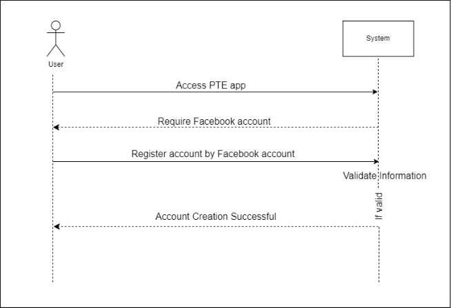
   ## 4.2.2. **Register account via Phone Number**
   ## 4.2.2.1.  **Description**

|**UC ID**|MPTE-FR-001-UC002||
| :- | :- | :- |
|**Use case name**|Register account via Phone Number||
|**Scenario**|Register a new account with your phone number on the PT Express application.||
|**Triggering event**|The user selects the option "Register with phone number."||
|**Brief description**|This use case describes the process of registering a new account using a phone number.||
|**Actors**|User, Admin||
|**Related use cases**|Order Management||
|**Stakeholders**|User, PT Express application development team||
|**Preconditions**|Users need a valid phone number and access to the internet.||
|**Postconditions**|
- Account is created

- User logged in successfully

- The system records register activities
||
|**Flow of activities**|**Actor**|**System**|
||1\. User accesses PTE app  ||
||2\. User chooses to register on account by phone number ||
||3\. User enters phone number |3\.1. Checks the validity of the phone number and sends a confirmation code to that phone number (OTP)|
||4\. User enters OTP|4\.1. Checks the OTP code and confirms registration.|
||5\. User enters password|5\.1. Checks the validity of the password|
|||6\. The system confirms successful registration.|
|**Exception conditions**|1\. Number phone was used to register previously.||
||2\. Invalid number phone.||
||3\. User did not complete phone number authentication.||

   ## 4.2.2.2  **Activities Diagram**
   
   ## 4.2.2.3  **Sequence Diagram**
   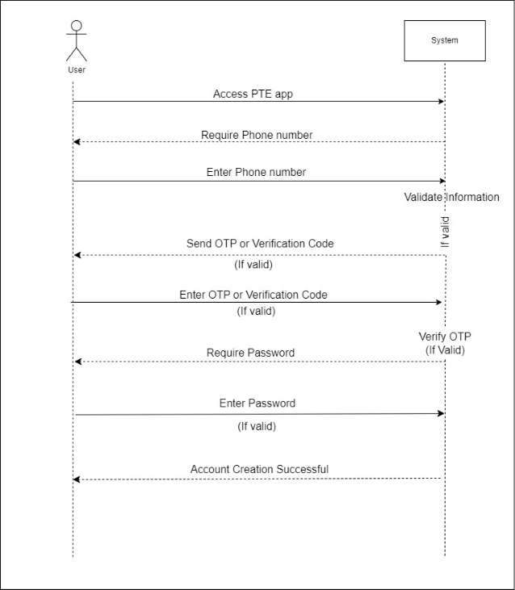

   ## 4.2.3. **Register account via Email address**
   ## 4.2.3.1  **Description**

|**UCID**|MPTE-FR-001-UC001||
| :- | :- | :- |
|**Use case name**|Register account via Email Address.||
|**Scenario**|Register a new account with your email address on the PT Express application.||
|**Triggering event**|The user selects the option "Register with email address."||
|**Brief description**|This use case describes the process of registering a new account using an email address.||
|**Actors**|User, Admin||
|**Related use cases**|Order Management||
|**Stakeholders**|User, PT Express application development team||
|**Preconditions**|Users need a valid email address and access to the internet.||
|**Postconditions**|
- Account is created

- User logged in successfully

- The system records register activities
||
|**Flow of activities**|**Actor**|**System**|
||1\. User accesses PTE app  ||
||2\. User chooses to register on account by email||
||3\. User enters email|3\.1. Checks the validity of the email and sends a confirmation code to that email (OTP)|
||4\. User enters OTP|4\.1. Checks the OTP code and confirms registration.|
||5\. User enters password|5\.1. Checks the validity of the password|
|||6\. The system confirms successful registration.|
|**Exception conditions**|1\. Email was used for previous registration. ||
||2\. Invalid email.||
||3\. User did not complete the authentication email.||

   ## 4.2.3.2  **Activities Diagram**
   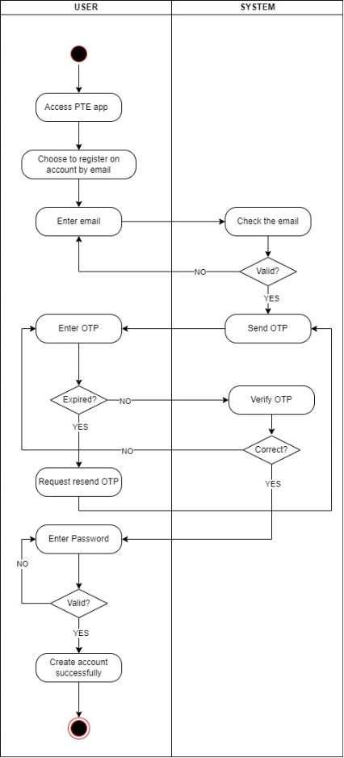
   ## 4.2.3.3  **Sequence Diagram**
   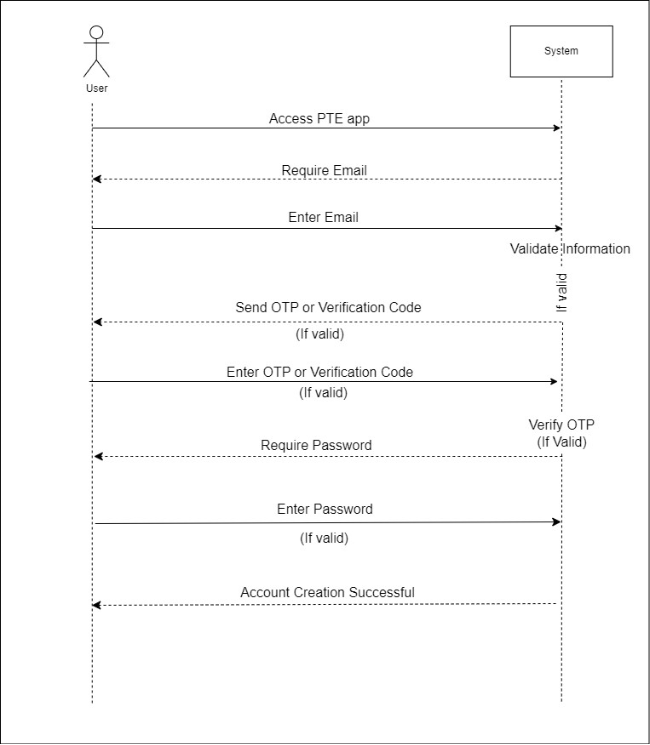
   ## 4.2.4 **Register account via Google**
   ## 4.2.4.1  **Description**

|**UCID**|MPTE-FR-001-UC004||
| :- | :- | :- |
|**Use case name**|<h2> egister account via Google</h2>||
|**Scenario**|The user signs up for a new account on the PTE app using Google.||
|**Triggering event**|Users select the "Sign up with Google logo" option on the app.||
|**Brief description**|This use case describes the process of registering a new account using Google accounts.||
|**Actors**|User, Admin||
|**Related use cases**|Order Management||
|**Stakeholders**|User, PT Express application development team||
|**Preconditions**|Users need a valid Google account and access to the internet.||
|**Postconditions**|
- Account is created

- User logged in successfully

- The system records register activities
||
|**Flow of activities**|**Actor**|**System**|
||1\. User accesses PTE app  ||
||2\. User chooses to register on account by Google||
||3\. User logins Google account|3\.1 The system checks the validity of Gmail and the password|
|||4\. The system confirms successful registration.|
|**Exception conditions**|1\. A Google account was used to register previously.||
||2\. Invalid Google account.||
||||

   ## 4.2.4.2  **Activities Diagram**
   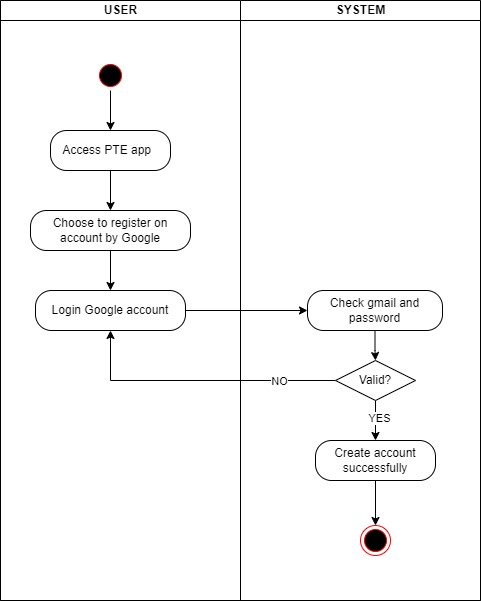
   ## 4.2.4.3  **Sequence Diagram**
   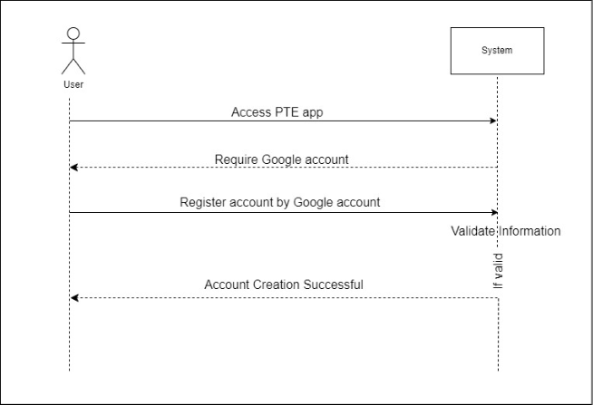
   ## 4.2.5 **Login account via Email** 
   ## 4.2.5.1  **Description**

|**UCID**|MPTE-FR-002-UC001||
| :- | :- | :- |
|**Use case name**|Login account via Email||
|**Scenario**|The user logins an account on the PTE app using Email.||
|**Triggering event**|The user selects the option "Login with Email."||
|**Brief description**|This use case describes the process of login an account using Email.||
|**Actors**|User, Admin||
|**Related use cases**|Order Management||
|**Stakeholders**|User, PT Express application development team||
|**Preconditions**|Users need a valid Email and access to the internet.||
|**Postconditions**|
- User logged in successfully

- The system records login activities
||
|**Flow of activities**|**Actor**|**System**|
||1\. User accesses PTE app  ||
||2\. User selects login account by Email||
||3\. User enters Email and password||
||4\. If the user forgets the password, user will be request to send a code to change the password|3\.1. The system sends a code|
||5\. User will change a new password||
||6\. User logs back in||
|||7\. The system confirms successful login.|
|**Exception conditions**|1\. Invalid Email.||
||2\. User's account didn't existed||

   ## 4.2.5.2  **Activities Diagram**
   
   ## 4.2.5.3  **Sequence Diagram**
   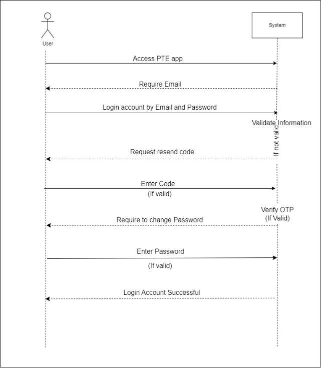
   ## 4.2.6 **Login account via Phone Number**
   ## 4.2.6.1  **Description**

|**UCID**|MPTE-FR-002-UC002||
| :- | :- | :- |
|**Use case name**|Login account via Phone Number||
|**Scenario**|The user logins an account on the PTE app using Phone Number.||
|**Triggering event**|The user selects the option "Login with phone number."||
|**Brief description**|This use case describes the process of login an account using a phone number.||
|**Actors**|User, Admin||
|**Related use cases**|Order Management||
|**Stakeholders**|User, PT Express application development team||
|**Preconditions**|Users need a valid phone number and access to the internet.||
|**Postconditions**|
- User logged in successfully

- The system records login activities
||
|**Flow of activities**|**Actor**|**System**|
||1\. User accesses PTE app  ||
||2\. User selects login account by phone number||
||3\. User enters phone number and password||
||4\. If the user forgets the password, user will be request to send a code to change the password|3\.1. The system sends a code|
||5\. User will change a new password||
||6\. User logs back in||
|||7\. The system confirms successful login.|
|**Exception conditions**|1\. Invalid number phone.||
||2\. User's account didn't existed||

   ## 4.2.6.2  **Activities Diagram**
   
   ## 4.2.6.3  **Sequence Diagram**
   
   ## 4.2.7. **Login account via Facebook**
   ## 4.2.7.1  **Description**

|**UCID**|MPTE-FR-002-UC003||
| :- | :- | :- |
|**Use case name**|Login account via Facebook||
|**Scenario**|The user logins an account on the PTE app using Facebook.||
|**Triggering event**|Users select the "Login with Facebook logo" option on the app.||
|**Brief description**|This use case describes the process of login an account using Facebook accounts.||
|**Actors**|User, Admin||
|**Related use cases**|Order Management||
|**Stakeholders**|User, PT Express application development team||
|**Preconditions**|Users need a valid Facebook account and access to the internet.||
|**Postconditions**|
- User logged in successfully

- The system records login activities
||
|**Flow of activities**|**Actor**|**System**|
||1\. User accesses PTE app  ||
||2\. User selects login account by Facebook||
||3\. If the user forgets the password, user will be request to send a code to change the password|3\.1. The system sends a code|
||4\. User will change a new password||
||5\. The user continues to login Facebook account|5\.1. The system checks the validity of username and the password|
|||6\. The system confirms successful login.|
|**Exception conditions**|1\. Invalid Facebook account.||
||2\. User's account didn't existed||

   ## 4.2.7.2  **Activities Diagram**
   
   ## 4.2.7.3  **Sequence Diagram**
   

   ## 4.2.8 **Login account via Google**
   ## 4.2.8.1  **Description**

|**UCID**|MPTE-FR-002-UC004||
| :- | :- | :- |
|**Use case name**|Login account via Google||
|**Scenario**|The user logins an account on the PTE app using Google.||
|**Triggering event**|Users select the "Login with Google logo" option on the app.||
|**Brief description**|This use case describes the process of login an account using Google accounts.||
|**Actors**|User, Admin||
|**Related use cases**|Order Management||
|**Stakeholders**|User, PT Express application development team||
|**Preconditions**|Users need a valid Google account and access to the internet.||
|**Postconditions**|
- User logged in successfully

- The system records login activities
||
|**Flow of activities**|**Actor**|**System**|
||1\. User accesses PTE app  ||
||2\. User selects login account by Google||
||3\. If the user forgets the password, user will be request to send a code to change the password|3\.1. The system sends a code|
||4\. User will change a new password||
||5\. The user continues to login Google account|5\.1. The system checks the validity of Gmail and the password|
|||6\. The system confirms successful login.|
|**Exception conditions**|1\. Invalid Google account.||
||2\. User's account didn't existed||

   ## 4.2.8.2  **Activities Diagram**
   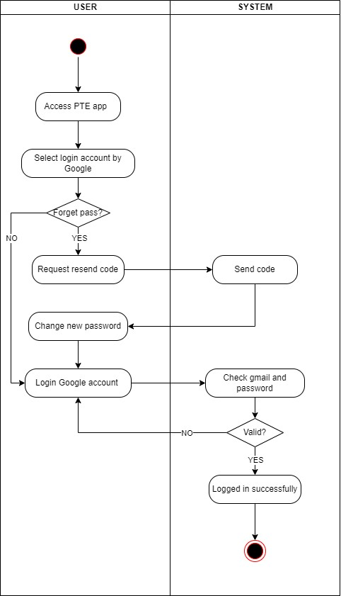
   ## 4.2.8.3  **Sequence Diagram**
   
   ## 4.2.9 **Change the password via SMS OTP**
   ## 4.2.9.1  **Description**

|**UC ID**|MPTE-FR-003-UC001||
| :- | :- | :- |
|**Use case name**|Change the password via SMS OTP||
|**Scenario**|The user change a new password on the shipping app by sending SMS||
|**Triggering event**|Users select the "Forgot password" option on the app.||
|**Brief description**|This use case describes the process of changing a new password by sending OTP to their phone.||
|**Actors**|Sender||
|**Related use cases**|Login||
|**Stakeholders**|User, PT Express application development team||
|**Preconditions**|Users need a valid phone number, user account must be existed and access to the internet.||
|**Postconditions**|User's password changed and can log in to the system after authenticating their phone number.||
|**Flow of activities**|**Actor**|**System**|
||1\. User selects "Forgot password".|1\.1. Display phone number form and "Other method"|
||2\. User enters phone number|2\.1 The system checks if phone number valid|
|||2\.2. The system sends a OTP code.|
||3\. Enter OTP code|3\.1 OTP code authentication system|
||4\. Enter a new password twice|4\.1. The system check if 1st password and 2nd password match|
|||4\.2. User's password is changed|
||5\. User is logged in and use the app||
|**Exception conditions**|1\. Invalid number phone.||
||2\. User did not complete phone number authentication.||
||3\. User's account didn't existed||

   ## 4.2.9.2  **Activities Diagram**
   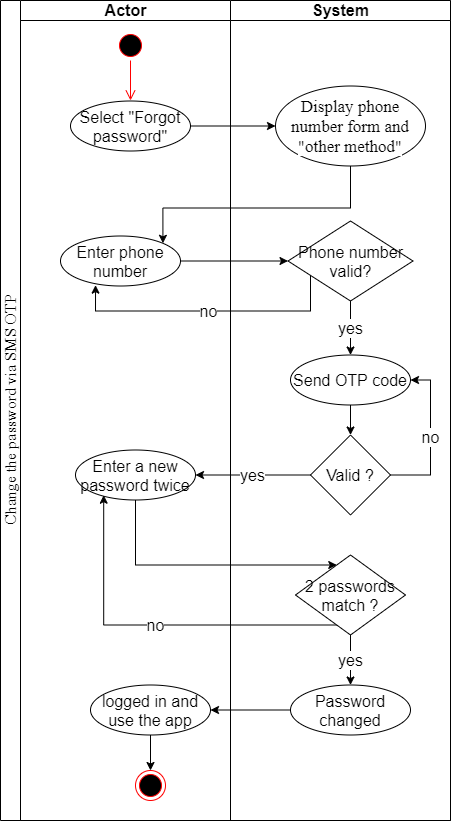
   ## 4.2.9.3  **Sequence Diagram**
   
   ## 4.2.10  **Change link password via email** 
   ## 4.2.10.1 **Description**

|**UC ID**|MPTE-FR-003-UC002||
| :- | :- | :- |
|**Use case name**|Change link password via email||
|**Scenario**|The user change a new password on the shipping app by sending email||
|**Triggering event**|
Users select the "Forgot password" option on the app.

Users select "Sending email" option
||
|**Brief description**|This use case describes the process of changing a new password by sending verify code to their email.||
|**Actors**|Sender||
|**Related use cases**|Login||
|**Stakeholders**|User, PT Express application development team||
|**Preconditions**|Users need a valid email, user account must be existed and access to the internet.||
|**Postconditions**|User's password changed and can log in to the system after authenticating their verify code from email.||
|**Flow of activities**|**Actor**|**System**|
||1\. User selects "Forgot password".|1\.1. Display phone number form and "Other method"|
||2\. User selects "Other method"||
||3\. User enters email|3\.1 The system checks if email valid|
|||3\.2. The system sends varify code|
||4\. Enter verify code|4\.1 Verify code authentication system|
||5\. Enter a new password twice|5\.1. The system check if 1st password and 2nd password match|
|||5\.2. User's password is changed|
||6\. User is logged in and use the app||
|**Exception conditions**|1\. Invalid email.||
||2\. User did not complete email authentication.||
||3\. User's account didn't existed||

## 4.2.10.1 **Activities Diagram**
   

## 4.2.10.2 **Sequence Diagram**

   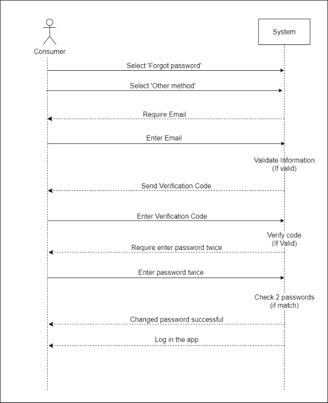

## 4.2.11 **Change link password via Zalo OTP**
   ## 4.2.11.1 **Description**

|**UC ID**|MPTE-FR-003-UC003||
| :- | :- | :- |
|**Use case name**|Change link password via Zalo OTP||
|**Scenario**|The user change a new password on the shipping app by sending Zalo message||
|**Triggering event**|Users select the "Forgot password" option on the app.||
|**Brief description**|This use case describes the process of changing a new password by sending OTP to their Zalo app.||
|**Actors**|Sender||
|**Related use cases**|Login||
|**Stakeholders**|User, PT Express application development team||
|**Preconditions**|Users need a valid phone number, user account must be existed and access to the internet.||
|**Postconditions**|User's password changed and can log in to the system after authenticating their phone number.||
|**Flow of activities**|**Actor**|**System**|
||1\. User selects "Forgot password".|1\.1. Display phone number form and "Other method"|
||2\. User enters phone number||
||3\. Select "Send code by Zalo"|3\.1 The system checks if phone number valid|
|||3\.2. The system sends a OTP code.|
||4\. Enter OTP code|4\.1 OTP code authentication system|
||5\. Enter a new password twice|5\.1. The system check if 1st password and 2nd password match|
|||5\.2. User's password is changed|
||6\. User is logged in and use the app||
|**Exception conditions**|1\. Invalid number phone.||
||2\. User did not complete phone number authentication.||
||3\. User's account didn't existed||
## 4.2.11.2 **Activities Diagram**
   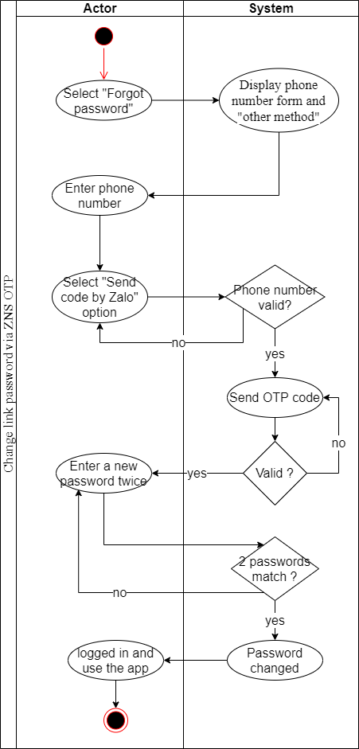
## 4.2.11.3 **Sequence Diagram**
   

## 4.2.12 **Stay logged in account**
   ## 4.2.12.1 **Description**

|**UC ID**|MPTE-FR-004-UC001||
| :- | :- | :- |
|**Use case name**|Stay logged in account||
|**Scenario**|The user can stay logged in their account when they reopen the app||
|**Triggering event**|Users select the "Stay logged in" option when users log in their account for the first time on their device.||
|**Brief description**|This use case describes the process of staying logged in of user's account||
|**Actors**|Sender||
|**Related use cases**|Login||
|**Stakeholders**|User, PT Express application development team||
|**Preconditions**|User's account must be existed and access to the internet.||
|**Postconditions**|User log in and use the app, user doesn't need to type their account log in information for the next time||
|**Flow of activities**|**Actor**|**System**|
||1\. User fill log in information||
||2\. User select "Stay logged in" option||
||3\. User click "Log in"|3\.1. System check log in information|
||4\. User logged in and use the app||
||5\. User's account stay loged in in their device||
|**Exception conditions**|1\. Log in information not correct.||
||2\. User's account didn't existed.||
## 4.2.12.2 **Activities Diagram**
   
## 4.2.12.3 **Sequence Diagram**
   
## 4.2.13 **Create Order under 20kg**
   ## 4.2.13.1 **Description**
|**UC ID**|MPTE-FR-05-UC001 ||
| :- | :- | :- |
|**Use case name**|Create Order under 20kg||
|**Scenario**|This use case details the process where a sender uses the mobile app to create a shipping order for a package weighing less than 20kg, along with selecting specific service options and policies.||
|**Triggering event**|The sender decides to send a package that weighs less than 20kg and initiates the order creation process on the mobile app.||
|**Brief description**|This use case allows the sender to provide necessary shipment details, select service options and preferences, and submit the order for processing.||
|**Actors**|Sender (Primary)||
|**Related use cases**|||
|**Stakeholders**|
Sender: Needs a reliable and convenient way to send small packages.

PT Express: Seeks to provide a seamless order creation experience for its customers.
||
|**Preconditions**|
The sender is registered and logged into the PT Express app.

The sender has all the required details for the package and recipient.
||
|**Postconditions**|
The order is successfully created within the PT Express system.

The sender receives an order confirmation with a tracking ID and expected delivery details.
||
|**Flow of activities**|**Actor**|**System**|
||1. Launches the PT Express app and selects the option to create a new order for a package under 20kg.|1\.1 Displays a form for inputting order details.|
||2. Enters the pick-up and delivery addresses, and chooses delivery preferences.|2\.1 Requests details about the package, including type, weight, and value.|
||3. Selects additional services such as insurance and specifies return policies.|3\.1 Provides options for pick-up and return policies, allowing the sender to choose based on preference.|
||4. Chooses whether to save the information for future orders|4\.1 Summarizes the order details, including costs and services selected.|
||5. Reviews the summary and submits the order.|5\.1 Confirms the order creation and provides the sender with the order ID and expected delivery timeline|
|**Exception conditions**|1. Incomplete or incorrect information: The system prompts the sender to correct the missing or invalid details.||
||2. Service unavailability: The system notifies the sender if the chosen service is not available for the specified addresses or package details.||
||3. System failure or downtime: The sender is informed of the issue and may be advised to try again later.||

## 4.2.13.2 **Activities Diagram**
   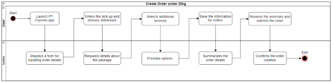
## 4.2.13.3 **Sequence Diagram**
   
## 4.2.14 **Create Order over 20kg**
   ## 4.2.14.1 **Description**
|**UC ID**|MPTE-FR-05-UC002||
| :- | :- | :- |
|**Use case name**|Create Order over 20kg||
|**Scenario**|The user creates an order for items that weigh more than 20 kilograms in total.||
|**Triggering event**|The user selects the "Create New Order" option and specifies that the total weight is over 20kg.||
|**Brief description**|The process includes selecting items, checking weight limits, and submitting the order for additional handling due to increased weight.||
|**Actors**|User||
|**Related use cases**|Item Selection, Weight Confirmation, Special Handling Order Processing||
|**Stakeholders**|User, PT Express application development team||
|**Preconditions**|
- Users must be logged into their account.

- The selected items for the order must collectively weigh more than 20kg.
||
|**Postconditions**|
- The order has been created with the weight exceeding the 20kg limit.

- The user receives a confirmation with order details and a notice regarding additional handling due to weight.
||
|**Flow of activities**|**Actor**|**System**|
||1\. User accesses the item selection interface.  ||
||2\. User selects items and indicates the total weight exceeds 20kg.||
||3\. User proceeds to special handling and shipping options for heavy orders.|3\.1 System validates the total weight is over 20kg.|
||4\. System prompts the user for special handling options due to excess weight.||
||5\. User confirms the order with the necessary additional options.|5\.1 System finalizes the order with special handling and provides a summary and confirmation to the user.|
|**Exception conditions**|1\. The total weight is incorrectly entered and does not exceed 20kg.||
||2\. The user's account is not recognized or is logged out during the process.||
||3\. System error occurs that prevents the order from being properly recorded or confirmed.||

## 4.2.14.2 **Activities Diagram**
   
## 4.2.14.3 **Sequence Diagram**
   
## 4.2.15 **Create Express Order**
   ## 4.2.15.1 **Description**
|**UCID**|MPTE-FR-05-UC003||
| :- | :- | :- |
|**Use case name**|Create Express Orders||
|**Scenario**|The user searches for details on a specific order using the order search functionality.||
|**Triggering event**|The user inputs an order ID or associated information into the search function within their account interface.||
|**Brief description**|This use case outlines the process by which a user can locate a specific order within the system using various search criteria such as order ID, date range, or item name. The user can review the order’s status, details, and history.||
|**Actors**|User||
|**Related use cases**|View Order Details, Track Order, View Order History||
|**Stakeholders**|User, PT Express application development team, Customer Service||
|**Preconditions**|
- Users must be logged into their account.

- The order ID or search criteria are known to the user.
||
|**Postconditions**|
- The user has located the order and accessed the detailed view of its status and history.

- The user can take further actions such as tracking the order, requesting support, or reordering.
||
|**Flow of activities**|**Actor**|**System**|
||1\. User accesses their account dashboard. ||
||2\. User enters the order ID or search criteria into the search function.|2\.1 System retrieves and displays a list of orders matching the search criteria.|
||3\. User selects an order from the search results to view details.|3\.1 System displays the detailed order information including status, items, and shipment tracking.|
|**Exception conditions**|1\. No order matches the search criteria entered by the user.||
||2\. The user's account is not recognized or is logged out during the process.||
||3\. System error prevents search function from operating correctly.||

## 4.2.15.2 **Activities Diagram**
   
## 4.2.15.3 **Sequence Diagram**
   
## 4.2.16  **Search for an order**
   ## 4.2.16.1 **Description**
|**UCID**|MPTE-FR-06-UC001||
| :- | :- | :- |
|**Use case name**|Search for an order||
|**Scenario**|The user needs to locate a specific order or set of orders based on certain criteria like order ID, date, or status.||
|**Triggering event**|The user initiates a search query within the system to find an order.||
|**Brief description**|This use case describes the functionality that allows users to search for and find specific orders they have placed. The user can input various search parameters to filter and retrieve order details from their account.||
|**Actors**|User||
|**Related use cases**|View Order History, Track Order Status, Modify Order Details||
|**Stakeholders**|User, PT Express application development team, Customer Service, Data Management Team||
|**Preconditions**|
- The user must be logged into their account.

- The search functionality is available and operational.
||
|**Postconditions**|
- The user successfully retrieves the information on the order(s) they were searching for.

- The system may log the search activity for future recommendations or audits.
||
|**Flow of activities**|**Actor**|**System**|
||1\. User accesses the search feature within their account dashboard.||
||2\. User inputs the order ID or other relevant search criteria into the search bar.|2\.1 System processes the search query and retrieves matching orders from the database.|
||3\. System displays the list of orders that match the search criteria.||
||4\. User reviews the search results and selects an order to view more details.|4\.1 System presents the detailed information of the selected order.|
|**Exception conditions**|1\. The search criteria provided by the user yields no results.||
||2\. The user's input is invalid or the search query is formatted incorrectly.||
||3\. The user's session times out or the account is logged out inadvertently.||

## 4.2.16.2 **Activities Diagram**
   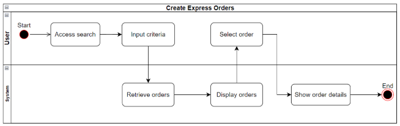
## 4.2.16.3 **Sequence Diagram**
   

## 4.2.17 **Print the order**
   ## 4.2.17.1 **Description**

|**UCID**|MPTE-FR-06-UC002||
| :- | :- | :- |
|**Use case name**|Print the order||
|**Scenario**|The user selects an order from their account and prints out the order details.||
|**Triggering event**|The user clicks on the "Print Order" button or option associated with a specific order.||
|**Brief description**|This use case details the steps a user must follow to print the details of an order they have made. This includes accessing the order, reviewing the details, and initiating the printing process through the system interface.||
|**Actors**|User||
|**Related use cases**|User, PT Express application development team, Customer Service||
|**Stakeholders**|User, PT Express application development team, Shipping Department, Customer Service||
|**Preconditions**|
- Users must be logged into their account.

- The user has access to a printer.

- The order details must be available for print.
||
|**Postconditions**|
- The user has a printed copy of the order details.

- The system logs the print action for reference.
||
|**Flow of activities**|**Actor**|**System**|
||1\. User navigates to the order history and selects an order.||
||2\. User clicks on the "Print Order" option.|2\.1 System generates a print-friendly version of the order details|
||3\. User confirms the print command on their computer or device.|3\.1 System sends the print job to the user's connected printer and logs the action.|
|**Exception conditions**|1\. The printer is not available or there is a connectivity issue.||
||2\. There are no order details available to print due to a system error or access restriction.||
||3\. The user's account is not recognized or is logged out before the print command is executed.||

## 4.2.17.2 **Sequence Diagram**
   

## 4.2.18 **Export the order to Excel**
   ## 4.2.18.1 **Description**
  
|**UCID**|MPTE-FR-06-UC003||
| :- | :- | :- |
|**Use case name**|Export the order to Excel||
|**Scenario**|The user wants to export the details of an order to an Excel spreadsheet.||
|**Triggering event**|The user clicks on an "Export to Excel" button or link for a specific order.||
|**Brief description**|This use case specifies the process by which a user can export the details of their order into an Excel file format. The functionality is designed to facilitate users in downloading their order data for record-keeping, further analysis, or reporting purposes.||
|**Actors**|User||
|**Related use cases**|View Order Details, Print the Order, Manage Order Reports||
|**Stakeholders**|User, PT Express application development team, Finance Department, Customer Service||
|**Preconditions**|
- The user must be logged into their account.

- The order details are available and eligible for export.

- The system must have the capability to generate an Excel file from the order data.
||
|**Postconditions**|
- The user has successfully downloaded an Excel file containing the order details.

- The system logs the export action for audit and tracking purposes.
||
|**Flow of activities**|**Actor**|**System**|
||1\.User navigates to the order details page.||
||2\. User selects the "Export to Excel" option for the order.|2\.1 System compiles the order details into an Excel file format.|
||3\. System prompts the user to confirm the download of the Excel file.||
||4\. User confirms the download and chooses a location to save the file.|4\.1 System saves the Excel file to the specified location and updates the user's download history.|
|**Exception conditions**|1\. There is an issue with the system's export function, resulting in failure to create or download the file.||
||2\. The user's session expires or the user is logged out before the export can be completed.||
||3\.The user does not have the necessary permissions or entitlements to export order data.||

## 4.2.18.2 **Activities Diagram**
   
## 4.2.18.3 **Sequence Diagram**
   

## 4.2.19 **View orders by status**
   ## 4.2.19.1 **Description**
|**UCID**|MPTE-FR-06-UC004||
| :- | :- | :- |
|**Use case name**|View orders by status||
|**Scenario**|The user filters and views orders based on their current status, such as pending, shipped, or delivered.||
|**Triggering event**|The user selects a filter option to sort orders by their status within the order management interface.||
|**Brief description**|This use case illustrates the steps for users to filter and view their orders according to the status of each order. It allows users to quickly identify and manage orders at different stages of the fulfillment process.||
|**Actors**|User||
|**Related use cases**|Search for an Order, Track Order, Update Order Status||
|**Stakeholders**|User, PT Express application development team, Shipping Department, Customer Service||
|**Preconditions**|
- The user must be logged into their account.

- There are existing orders with varying statuses.
||
|**Postconditions**|
- The user can view a list of orders filtered by the selected status.

- The system may offer additional actions based on the order status, such as tracking or reordering.
||
|**Flow of activities**|**Actor**|**System**|
||1\. User navigates to the order history or management section.||
||2\. User selects a status-based filter (e.g., "Pending," "Shipped," "Delivered").|2\.1 System applies the filter and displays orders matching the selected status.|
||3\. User reviews the filtered order list and selects an order for detailed view if needed.|3\.1 System provides detailed information for the selected order.|
|**Exception conditions**|1. No orders match the selected status filter.||
||2. The user's account is not recognized, or the user is logged out during the process.||
||3. A system error occurs, preventing the correct display of orders by status.||

## 4.2.19.2 **Activities Diagram**
   
## 4.2.19.3 **Sequence Diagram**
   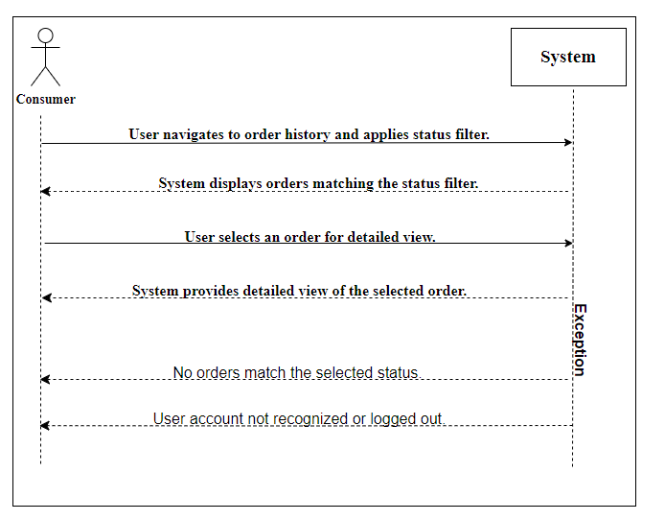

## 4.2.20 **Scheduling a pickup**
   ## 4.2.20.1 **Description**
|**UCID**|MPTE-FR-06-UC005||
| :- | :- | :- |
|**Use case name**|Scheduling a Pickup||
|**Scenario**|The user schedules a pickup for an order to be shipped.||
|**Triggering event**|The user selects the "Schedule a Pickup" option for an order that is ready to be shipped.||
|**Brief description**|This use case describes the process for a user to schedule a pickup for their package. The user can select a date and time for the pickup and provide necessary details for the courier.||
|**Actors**|User||
|**Related use cases**|Create Order, Update Order Details, Cancel Pickup||
|**Stakeholders**|User, PT Express application development team, Shipping Department, Courier Services||
|**Preconditions**|
- The user must be logged into their account.

- The order must be placed and confirmed, awaiting shipment.

- Pickup services must be available for the user's location.
||
|**Postconditions**|
- A pickup for the order has been scheduled.

- The user receives a confirmation of the scheduled pickup with date and time.

- The courier service is notified of the scheduled pickup.
||
|**Flow of activities**|**Actor**|**System**|
||1\. User navigates to the order they wish to schedule for pickup.||
||2\. User selects the "Schedule a Pickup" option.|2\.1 System displays the scheduling interface with available dates and times.|
||3\. User enters the desired pickup details and confirms the schedule.|3\.1 System confirms the availability and schedules the pickup.|
||4\. System sends a confirmation to the user and notifies the courier service.||
|**Exception conditions**|1\. No pickup times are available for the user's location or selected time frame.||
||2\. The user's account is not recognized, or the user is logged out during the process.||
||3\. A system error occurs, preventing the pickup from being scheduled.||

## 4.2.20.2 **Activities Diagram**
   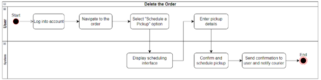
## 4.2.20.3 **Sequence Diagram**
   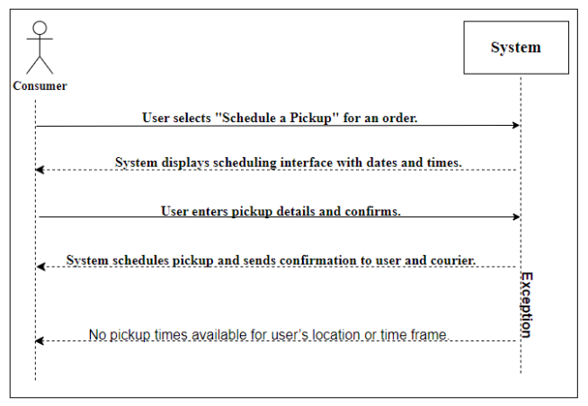

## 4.2.21 **Delete the order**
   ## 4.2.21.1 **Description**
|**UCID**|MPTE-FR-06-UC007||
| :- | :- | :- |
|**Use case name**|Delete the Order||
|**Scenario**|The user chooses to delete an order from their account.||
|**Triggering event**|The user selects the "Delete Order" option for a particular order that they wish to remove.||
|**Brief description**|This use case defines the steps that a user follows to permanently remove an order from their account history. This may be used for orders that have been canceled, are incorrect, or are no longer needed for record.||
|**Actors**|User||
|**Related use cases**|Cancel Order, Create Order, View Order History||
|**Stakeholders**|User, PT Express application development team, Customer Service||
|**Preconditions**|
- The user must be logged into their account.

- The order is in a state that allows for deletion (e.g., not processed or shipped).
||
|**Postconditions**|
- The order is permanently deleted from the user's account and the system's records.

- The user receives confirmation that the order has been deleted.
||
|**Flow of activities**|**Actor**|**System**|
||1\. User navigates to the order history and selects the order to delete.||
||2\. User clicks on the "Delete Order" option. |2\.1. System prompts the user to confirm the deletion of the order.|
||3\. User confirms the deletion. |3\.1 System permanently deletes the order from the records and updates the user's order history.|
|**Exception conditions**|1\. The order cannot be deleted due to its status (e.g., already shipped or in transit).||
||2\. The user's account is not recognized, or the user is logged out during the deletion process. ||
||3\. A system error occurs, preventing the order from being deleted.||

## 4.2.21.2 **Activities Diagram**
   
## 4.2.21.3 **Sequence Diagram**
   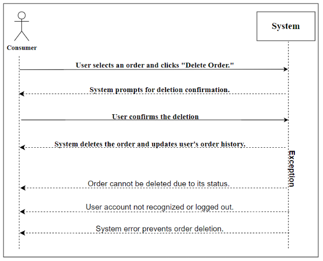
## 4.2.22  **View Orders that are being processed**
   ## 4.2.22.1 **Description**

|**UCID**|MPTE-FR-021-UC001||
| :- | :- | :- |
|**Use case name**|View Orders Being Processed||
|**Scenario**|The user checks the status of orders that are currently being processed in the system.||
|**Triggering event**|The user selects the option to view current orders from their account dashboard.||
|**Brief description**|This use case outlines the steps for a user to view the status of all orders that are in the process of being completed.||
|**Actors**|User, Order Processing System||
|**Related use cases**|Order Placement, Order Tracking, Order History||
|**Stakeholders**|User, PT Express application development team||
|**Preconditions**|Users must be logged into their account.||
|**Postconditions**|
The system displays a list of orders that are being processed.

The user can view details of each order’s status.
||
|**Flow of activities**|Actor|System|
||1\. User selects the option to view 'Orders Being Processed'.|1\.1. System retrieves the list of orders that are currently being processed for the user.|
|||2\.1. System displays the list of orders with status details.|
|**Exception conditions**|1\. No orders are currently being processed.||
||2\. System cannot retrieve the order data due to a technical issue.||

## 4.2.22.2 **Activities Diagram**
   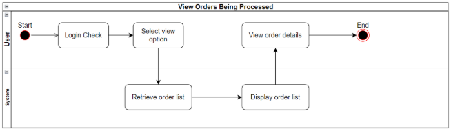
## 4.2.22.3 **Sequence Diagram**
   

## 4.2.23 **View revenue statistics**
   ## 4.2.23.1 **Description**
|**UC ID**|MPTE-FR-019-UC001||
| :- | :- | :- |
|**Use case name**|View Revenue Statistics||
|**Scenario**|The user views revenue statistics from the system for a given time period.||
|**Triggering event**|The user selects the option to view revenue statistics in the system's reporting interface.||
|**Brief description**|This use case outlines the process a user follows to view and analyze revenue statistics, such as total sales, average transaction value, and revenue growth over time.||
|**Actors**|User||
|**Related use cases**|Generate Sales Report, Export Data, Customize Report View||
|**Stakeholders**|User, PT Express financial team, PT Express management team||
|**Preconditions**|
Users must be logged into their account with the necessary access rights.

The system must have collected and processed transaction data.

The system must be configured to generate statistical data based on the stored transaction data.
||
|**Postconditions**|
- The system displays the requested revenue statistics.

- The system may log the user's access to the report for audit and compliance.
||
|**Flow of activities**|Actor|System|
||1\. User navigates to the 'View Reports' interface. |1\.1. System retrieves the relevant revenue data for the specified time period.|
||2\. User selects the 'Revenue Statistics' report type and specifies the time period.|2\.1. System processes the data to calculate revenue statistics.|
|||3\.1. System displays the revenue statistics report to the user.|
|**Exception conditions**|1\. The system cannot retrieve revenue data for the specified time period.||
||2\. The system identifies an error in the revenue data that may affect the accuracy of the statistics.||
||3\. User cancels the report generation process||

## 4.2.23.2 **Activities Diagram**
    
## 4.2.23.3 **Sequence Diagram**
   

## 4.2.24 **View revenue Summary**
   ## 4.2.24.1 **Description**

|**UC ID**|MPTE-FR-019-UC002||
| :- | :- | :- |
|**Use case name**|Revenue Summary ||
|**Scenario**|The user accesses a summary of revenue figures through the system's reporting features.||
|**Triggering event**|The user selects the option to view a summary of revenue in the system's user interface.||
|**Brief description**|This use case describes the process for a user to view a condensed summary of revenue, including key metrics like total revenue, cost, and profit for a selected period.||
|**Actors**|User||
|**Related use cases**|View Detailed Revenue Report, View Profit and Loss Statement, Download Revenue Summary||
|**Stakeholders**|User, PT Express financial team, PT Express management team||
|**Preconditions**|
- Users must be logged into their account with the appropriate permissions.

- The system has aggregated revenue data available for reporting.

- The system is operational and capable of generating summary reports.
||
|**Postconditions**|
- The revenue summary is presented to the user.

- User interactions with the system may be logged for security and audit purposes.
||
|**Flow of activities**|Actor||
||1\. User navigates to the 'View Summary' section under Reports.|1\.1. System retrieves revenue data for the selected time frame.|
||2\. User selects 'Revenue Summary' from the available report options.|2\.1. System calculates key revenue summary metrics.|
||3\. User specifies the desired time frame for the summary.|3\.1. System presents the revenue summary to the user.|
|**Exception conditions**|1\. Revenue data for the selected period is unavailable or incomplete.||
||2\. The user selects an invalid or unsupported time frame.||
||3\. User aborts the process before the summary is generated.||
||4\. System encounters an error while generating the summary, preventing the operation from completing successfully.||

## 4.2.24.2 **Activities Diagram**
   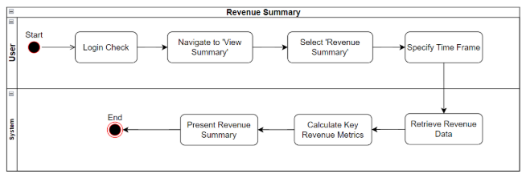
## 4.2.24.3 **Sequence Diagram**
   
## 4.2.24  **View order have been processed**
   ## 4.2.24.1 **Description**

|**UCID**|MPTE-FR-021-UC002||
| :- | :- | :- |
|**Use case name**|View Orders That Have Been Processed||
|**Scenario**|The user views the list of their orders that have been processed and completed by the system.||
|**Triggering event**|The user selects the "View Processed Orders" option in their account interface.||
|**Brief description**|This use case describes the steps for users to view their past orders that have been fully processed and are either awaiting shipment or have been shipped.||
|**Actors**|User||
|**Related use cases**|Order Placement, Order Tracking, Order History||
|**Stakeholders**|User, PT Express application development team||
|**Preconditions**|
- Users must be logged into their account.

- There must be past orders that have been processed.
||
|**Postconditions**|
- The user has viewed the list of processed orders.

- Users can request further details or follow-up actions on the orders if necessary.
||
|**Flow of activities**|Actor|System|
||1\.User accesses their account dashboard.|1\.1. System displays the list of processed orders to the user.|
||2\. User selects the "View Processed Orders" option.||
|**Exception conditions**|1\.No processed orders are available to view||
||2\. The user's account is not recognized or logged out.||
||3\. System error prevents retrieval or display of order information.||

## 4.2.24.2 **Activities Diagram**
   
## 4.2.24.3 **Sequence Diagram**
   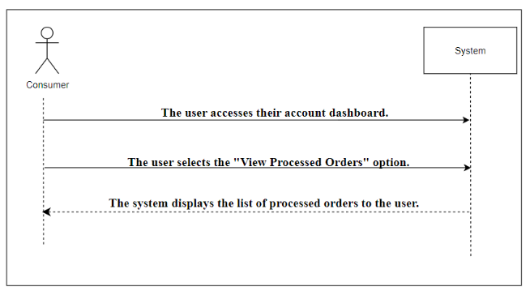
## 4.2.25  **Search recipient information**
   ## 4.2.25.1 **Description**
|**UCID**|MPTE-FR-022-UC001||
| :- | :- | :- |
|**Use case name**|Search Recipient Information||
|**Scenario**|The user performs a search for recipient information within the system to find details about an order's recipient.||
|**Triggering event**|The user initiates a search using the recipient's name, order number, or other identifying information.||
|**Brief description**|This use case details the steps a user must take to locate and view information about an order's recipient in the system||
|**Actors**|User||
|**Related use cases**|View Order Details, Update Order Information, Contact Recipient||
|**Stakeholders**|User, PT Express application development team||
|**Preconditions**|
- Users must be logged into their account or system.

- The system must have recipient information available for search.
||
|**Postconditions**|
- The user has accessed the recipient information.

- The system has recorded the search activity for audit purposes.
||
|**Flow of activities**|Actor|System|
||1. 1User navigates to the search interface|1\.1. System retrieves matching recipient information.|
||2. User enters search criteria related to the recipient (e.g., name, order number).|2\.1. System displays the results to the user.|
|**Exception conditions**|1. No matching recipient information is found.||
||2. Invalid search criteria are entered.||
||3. A system error occurs, preventing the search from being completed.||

## 4.2.25.2 **Activities Diagram**
   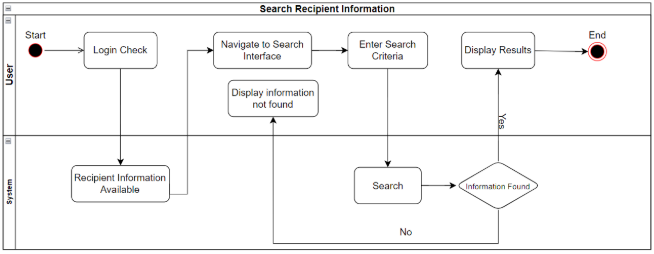
## 4.2.25.3 **Sequence Diagram**
   

## 4.2.26 **Update recipient information**
   ## 4.2.26.1 **Description**
|**UCID**|MPTE-FR-022-UC002||
| :- | :- | :- |
|**Use case name**|Update Recipient Information||
|**Scenario**|The user updates the contact information for a recipient in an existing order within the system.||
|**Triggering event**|The user selects the option to edit recipient details on an order's information page.||
|**Brief description**|This use case describes the user's process to update a recipient's contact details, such as name, address, or phone number, ensuring that the order reaches the correct destination.||
|**Actors**|User||
|**Related use cases**|Search Recipient Information, Confirm Order Details, Notify Recipient||
|**Stakeholders**|User, PT Express application development team||
|**Preconditions**|
- Users must be logged into their account.

- The order with the recipient information exists and is accessible.
||
|**Postconditions**|
- The recipient's information is updated in the system.

- The order details reflect the updated recipient information.
||
|**Flow of activities**|Actor|System|
||1. User selects an order to update.|1\.1. System allows editing of the recipient information fields.|
||2. User chooses to edit the recipient's information..|2\.1. User submits the updated information.|
|||3\.1. System validates and saves the updated information.|
|||4\.1. System confirms the update to the user.|
|**Exception conditions**|1. User attempts to update non-editable or locked order information.||
||2. Updated information fails validation checks (e.g., incorrect format for phone number).||
||3. System error occurs, preventing the update from being saved.||

## 4.2.26.2 **Activities Diagram**
   
## 4.2.26.3 **Sequence Diagram**

   

## 4.2.27 **Delete recipient information**
   ## 4.2.27.1 **Description**
|**UCID**|MPTE-FR-022-UC003||
| :- | :- | :- |
|**Use case name**|Delete Recipient Information||
|**Scenario**|The user removes a recipient's information from the system, typically associated with an order or customer profile.||
|**Triggering event**|The user selects the option to delete recipient information in the system interface.||
|**Brief description**|This use case outlines the process for a user to permanently delete a recipient's contact details from the system database.||
|**Actors**|User||
|**Related use cases**|Search Recipient Information, Update Recipient Information, View Order ||
|**Stakeholders**|User, PT Express application development team||
|**Preconditions**|
- Users must be logged into their account.

- The user has located the recipient information to be deleted.

- The system must confirm that the information can be safely deleted without affecting ongoing processes.
||
|**Postconditions**|
- The recipient's information is removed from the system.

- The system logs the deletion activity for audit and compliance.
||
|**Flow of activities**|Actor|System|
||1. User navigates to the recipient information interface.|1\.1. User confirms the deletion action..|
||2. User selects the recipient information to be deleted.|2\.1. System permanently removes the recipient information.|
|||3\.1. System displays a confirmation message to the user.|
|**Exception conditions**|1. The recipient information cannot be found.||
||2. The recipient information is associated with an ongoing order and cannot be deleted.||
||3. User cancels the deletion process.||
||4. A system error prevents the deletion from being executed.||

## 4.2.27.2 **Activities Diagram**
   
## 4.2.27.3 **Sequence Diagram**
   

## 4.2.28 **Create recipient information**
   ## 4.2.28.1 **Description**
|**UCID**|MPTE-FR-022-UC004||
| :- | :- | :- |
|**Use case name**|Create Recipient Information||
|**Scenario**|The user adds new recipient information into the system for an order or customer profile.||
|**Triggering event**|The user chooses the option to add new recipient details in the system's user interface.||
|**Brief description**|This use case describes the process a user follows to enter and save new recipient information into the system, such as the recipient's name, address, and contact details.||
|**Actors**|User||
|**Related use cases**|Search Recipient Information, Update Recipient Information, Validate Address||
|**Stakeholders**|User, PT Express application development team||
|**Preconditions**|
- Users must be logged into their account or have the necessary access rights.

- The system is ready to accept new data entries.
||
|**Postconditions**|
- New recipient information is created and stored in the system.

- The system may send a notification or confirmation to the user or recipient.
||
|**Flow of activities**|Actor|System|
||1\.User navigates to the 'Add New Recipient' interface.|1\.1. System saves the new recipient information to the database.|
||2\.User enters the new recipient's details into the provided fields..|2\.1. System provides a confirmation message or reference number to the user.|
|**Exception conditions**|1\.The recipient information cannot be found.||
||2\.The recipient information is associated with an ongoing order and cannot be deleted.||
||3\.User cancels the deletion process.||
||4\.A system error prevents the deletion from being executed.||

## 4.2.28.2 **Activities Diagram**
   
## 4.2.28.3 **Sequence Diagram**
   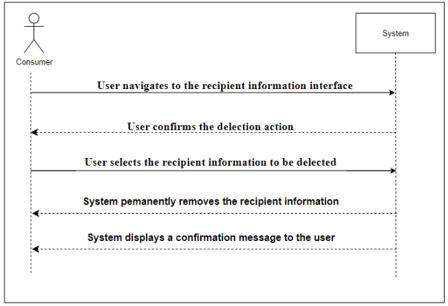
## 4.3 **Architecture System**
   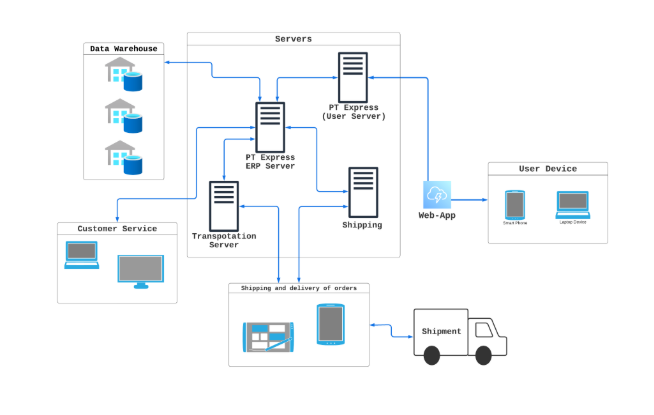
   

